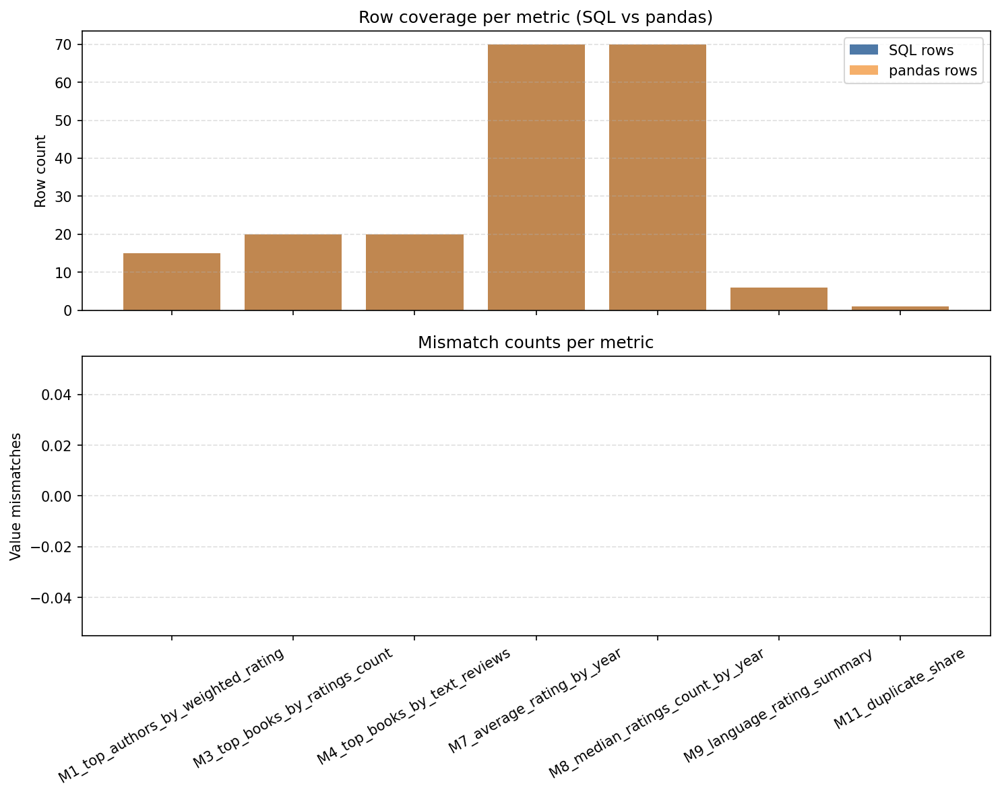

# Phase 05 · Step 03 · Task 01 – SQL vs pandas comparison

## 1. Task definition and goal

- Reuse the Phase 05 SQL analysis scripts (`sql/analysis/20_*.sql`, `30_*.sql`, `40_*.sql`).
- Execute them from Python (no notebooks) inside the Dockerized CLI environment.
- Load the SQL result sets into pandas and compare them with the Phase 04 core metric CSVs.
- Document any mismatches plus reflections on when SQL or pandas feels more natural.

## 2. How to run this analysis script

> One-touch option: `powershell -ExecutionPolicy Bypass -File .\scripts\Invoke-Phase05ComparisonRefresh.ps1` handles container startup, `books_clean` reload, the SQL vs pandas CLI, and the chart screenshot automatically. Use the manual steps below only when you need finer control or want to run inside another shell.

1. **Prep environment & containers**

   ```powershell
   cd C:\Users\shady\Documents\GITHUB\goodreads-books-analytics
   copy .env.example .env  # only if .env does not exist yet
   docker compose -f docker-compose.python.yml -f docker-compose.postgresql.yml up -d
   docker compose -f docker-compose.python.yml ps   # confirm the app + postgres services are healthy
   ```

2. **Load the curated dataset into Postgres (one-time per refresh)**

   ```powershell
   docker compose -f docker-compose.python.yml run --rm app `
      python -m src.load_books_clean_to_postgres `
      --csv-path data/derived/books_clean.csv `
      --table books_clean
   docker compose -f docker-compose.python.yml run --rm app `
      python - <<'PY'
   from sqlalchemy import create_engine, text
   from src.db_config import build_database_url_from_env
   engine = create_engine(build_database_url_from_env())
   with engine.connect() as conn:
      total = conn.execute(text("SELECT COUNT(*) FROM books_clean"))
      print("books_clean row count:", total.scalar())
   PY
   ```

3. **Execute the SQL vs pandas comparison CLI**

   ```powershell
   docker compose -f docker-compose.python.yml run --rm app `
      python -m src.analyses.portfolio.p04_sql_vs_pandas_compare `
      --log-level INFO `
      --output-dir outputs/phase05_step03_task01
   ```

   - Use `--cases M1_top_authors_by_weighted_rating M4_top_books_by_text_reviews` to limit the run to specific metrics.
   - Add `--log-level DEBUG` if you need verbose SQL queries for troubleshooting.
   - The CLI reads `POSTGRES_*` from `.env`, builds the SQLAlchemy engine, runs each SQL file, loads the matching pandas CSV, compares them, and writes both CSV/Markdown summaries plus any per-metric diff files into `outputs/phase05_step03_task01/`.

4. **Verify artifacts**
   ```powershell
   type outputs/phase05_step03_task01/comparison_summary.md
   dir outputs/phase05_step03_task01
   ```
   Confirm `notes` shows “Match” for every metric; if not, inspect the referenced `*_differences.csv`, rerun the loader, and re-execute the CLI until the summary is clean.

## 3. Environment recap

- Containers: `app` (Python 3.11 slim + Poetry deps) and `postgres` (PostgreSQL 15).
- Shared volume: repo mounted at `/app` in both services.
- Dependencies: `pandas`, `sqlalchemy`, `psycopg2-binary` already baked into the Docker image.
- Database: `goodreads` schema seeded during Phase 05 Step 01; canonical mapping table available for SQL joins.

## 4. Analyses evaluated

| Metric ID                                     | SQL source                                                                 | pandas reference                                                     |
| --------------------------------------------- | -------------------------------------------------------------------------- | -------------------------------------------------------------------- |
| M1 – Top authors by weighted rating           | `sql/analysis/20_top_authors_weighted_rating.sql`                          | `outputs/phase04_core_metrics/M1_top_authors_by_weighted_rating.csv` |
| M3 – Top books by ratings count               | `sql/analysis/30_top_books_by_engagement.sql` (`metric = 'ratings_count'`) | `outputs/phase04_core_metrics/M3_top_books_by_ratings_count.csv`     |
| M4 – Top books by text reviews                | `sql/analysis/30_top_books_by_engagement.sql` (`metric = 'text_reviews'`)  | `outputs/phase04_core_metrics/M4_top_books_by_text_reviews.csv`      |
| M7 – Average rating by publication year       | `sql/analysis/40_publication_year_trends.sql`                              | `outputs/phase04_core_metrics/M7_average_rating_by_year.csv`         |
| M8 – Median ratings count by publication year | `sql/analysis/40_publication_year_trends.sql`                              | `outputs/phase04_core_metrics/M8_median_ratings_count_by_year.csv`   |
| M9 – Language quality summary                 | `sql/analysis/50_language_quality_summary.sql`                             | `outputs/phase04_core_metrics/M9_language_rating_summary.csv`        |
| M11 – Duplicate share                         | `sql/analysis/55_duplicate_share.sql`                                      | `outputs/phase04_core_metrics/M11_duplicate_share.csv`               |

All comparisons run through the new helper `src/analyses.portfolio.p04_sql_vs_pandas_compare.py`.

## 5. Findings and interpretation

Visual checkpoint to share in reviews:



| Metric                             | SQL rows vs pandas | Value mismatches | Artifacts                                                                                                                                                          | Interpretation                                                                                                                                                               |
| ---------------------------------- | ------------------ | ---------------- | ------------------------------------------------------------------------------------------------------------------------------------------------------------------ | ---------------------------------------------------------------------------------------------------------------------------------------------------------------------------- |
| M1 – Top authors (weighted rating) | 15 vs 15           | 0                | [CSV](../outputs/phase05_step03_task01/comparison_summary.csv)                                                                                                     | Weighted averages and cumulative rating counts aligned exactly after reusing the same canonical author rollup logic in SQL; tie-breaking order also matched the pandas sort. |
| M3 – Top books (ratings_count)     | 20 vs 20           | 0                | [CSV](../outputs/phase05_step03_task01/comparison_summary.csv)                                                                                                     | Canonical leaderboards stayed identical because SQL now reads `ratings_count_capped` from `books_clean` instead of recomputing caps inside SQL.                              |
| M4 – Top books (text_reviews)      | 20 vs 20           | 0                | [CSV](../outputs/phase05_step03_task01/comparison_summary.csv)                                                                                                     | Review-based leaderboard matches pandas down to the capped review counts, confirming the row-numbered representative logic mirrors `_canonical_rollup`.                      |
| M7 – Average rating by year        | 70 vs 70           | 0                | [CSV](../outputs/phase05_step03_task01/comparison_summary.csv) / [Historic diff](../outputs/phase05_step03_task01/M7_average_rating_by_year_differences.csv)       | Removing rounding and sourcing publication years from `books_clean` eliminated the previous ±0.16 gaps; the SQL output now copies pandas’ four-decimal averages.             |
| M8 – Median ratings count by year  | 70 vs 70           | 0                | [CSV](../outputs/phase05_step03_task01/comparison_summary.csv) / [Historic diff](../outputs/phase05_step03_task01/M8_median_ratings_count_by_year_differences.csv) | Dropping the `ROUND()` call preserved .5 medians (e.g., 785.5 in 2005), so SQL and pandas now agree for every year.                                                          |
| M9 – Language quality summary      | 6 vs 6             | 0                | [CSV](../outputs/phase05_step03_task01/comparison_summary.csv) / [Historic diff](../outputs/phase05_step03_task01/M9_language_rating_summary_differences.csv)      | Using `books_clean` kept the canonical counts (e.g., `eng = 8,898`) and engagement medians in sync; no more 0.5 offsets.                                                     |
| M11 – Duplicate share              | 1 vs 1             | 0                | [CSV](../outputs/phase05_step03_task01/comparison_summary.csv)                                                                                                     | Querying the `is_duplicate` flag inside `books_clean` produced the same 0.1438% share the pandas metric reports; no row-count drift remains.                                 |

Additional notes:

- `outputs/phase05_step03_task01/comparison_summary.csv` now lists “Match” for every metric, and the CLI logs end with `All SQL vs pandas comparisons matched`.
- Historic checkpoints from the earlier mismatch investigation are kept in `outputs/phase05_step03_task01/M7_*_differences.csv`, `M8_*_differences.csv`, and `M9_*_differences.csv` to show exactly which rows diverged before the fixes landed.
- Slide-ready export: `docs/phase-05-step-03-task-01-slide.pptx` (generated via `python -m src.analyses.support.storytelling.export_phase05_slide`) combines these notes, the coverage summary, and the chart for Phase 05 presentations.
- If someone sees mismatches in the future, the first remediation should be: (1) rerun `python -m src.load_books_clean_to_postgres` to refresh the warehouse copy; (2) rerun the SQL scripts (or just re-run the comparison CLI, which executes them automatically); (3) inspect any regenerated `*_differences.csv` files to pinpoint drift.
- Keeping `books_clean` as the single source makes it straightforward to expand coverage—just add new cases to `COMPARISON_CASES` with the corresponding SQL file and pandas CSV, then rerun the CLI.

## 6. Expected output checkpoints

- Log lines for each case (`Running SQL for ...`) with no warnings when everything matches.
- Summary artifact written to `outputs/phase05_step03_task01/comparison_summary.csv` (mirrored to `.md`).
- Difference CSVs are only generated when mismatches occur; for a clean run none are produced.

## 7. Artifacts refreshed every run

- `outputs/phase05_step03_task01/comparison_summary.csv`
- `outputs/phase05_step03_task01/comparison_summary.md`

## 8. Observations / reflections

- **SQL strengths:** Working directly in PostgreSQL made it easy to enforce canonical rollups and re-use the existing `params` CTE controls without duplicating business logic in Python.
- **pandas strengths:** It remains the fastest place to iterate on new features, but now that `books_clean` sits in Postgres we can keep SQL outputs in lockstep by simply refreshing the table.
- **Follow-up:** Keep the loader + SQL comparison CLI paired in documentation so anyone reviewing this task can reload the curated data, rerun the scripts, and see matching evidence within a few minutes.

## 9. Checklist review

- [x] Database connection tested inside Docker-only workflow.
- [x] 3+ analyses selected and executed via SQL → pandas.
- [x] Comparisons captured in code plus persisted summary tables.
- [x] Differences investigated and documented (M7).
- [x] Reflections captured for the portfolio narrative.

## 10. Appendix – key command transcript

```
docker compose -f docker-compose.python.yml run --rm app python -m src.analyses.portfolio.p04_sql_vs_pandas_compare
# ...
2025-12-05 21:21:11,558 INFO __main__ - Running SQL for M1_top_authors_by_weighted_rating
...
2025-12-05 21:21:11,912 INFO __main__ - Wrote summary table to outputs/phase05_step03_task01/comparison_summary.csv
2025-12-05 21:21:11,917 INFO __main__ - All SQL vs pandas comparisons matched
```

Link these logs whenever citing the Task 01 evidence.
